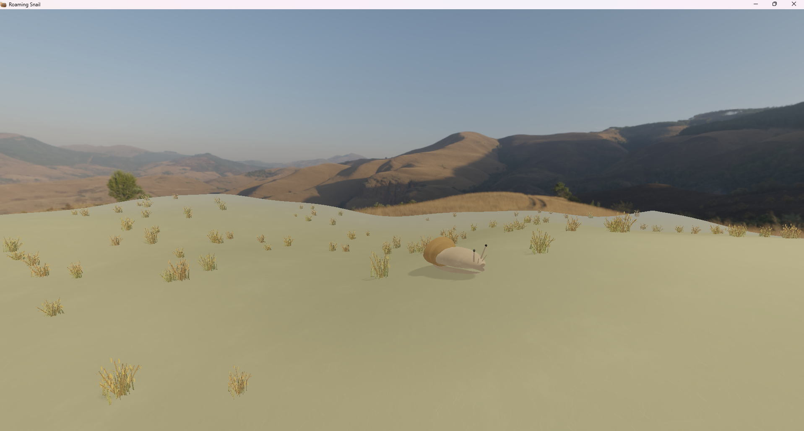
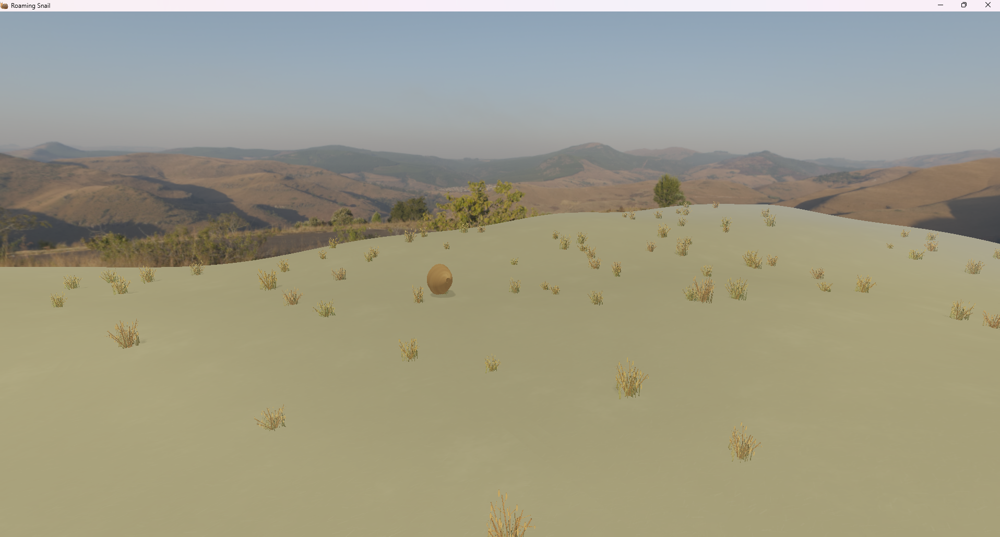
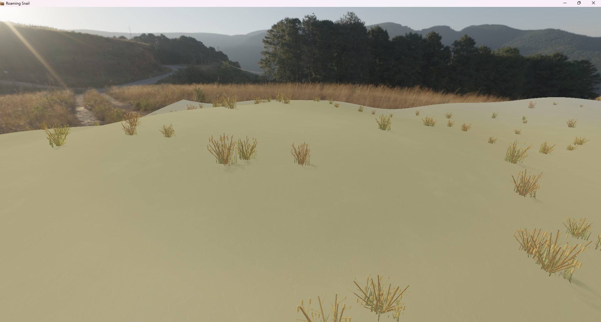
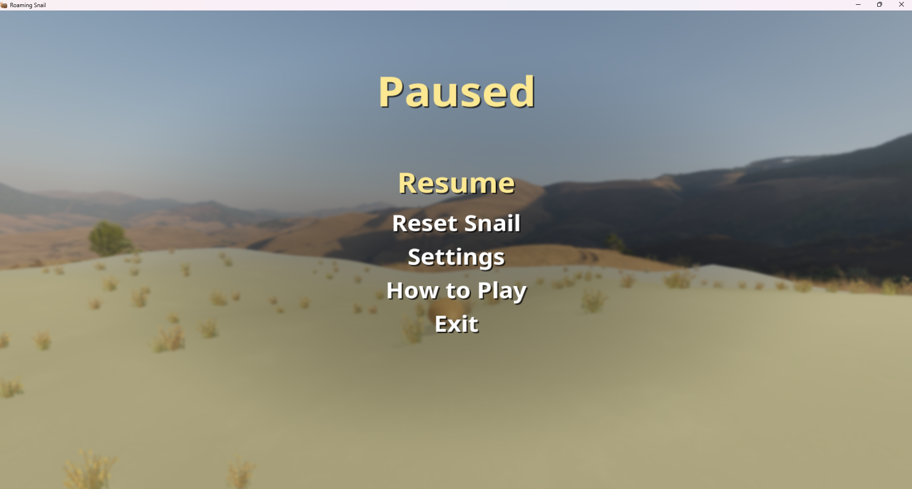
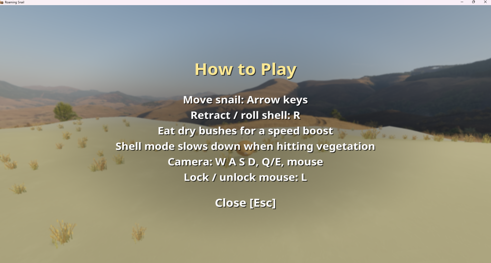

# Roaming Snail

Roaming Snail is a real-time 3D OpenGL/C++ project focused on procedural outdoor rendering, interactive character movement, terrain-aware gameplay physics, vegetation interaction, HDR environment lighting, shadow mapping, post-processing, and a custom menu/UI system.

The project presents a small playable outdoor scene where the player controls a snail exploring a rolling-hills environment. The snail can move normally across the terrain, retract into its shell, roll downhill, launch over hills at high speeds, bounce when colliding with the ground, and interact with vegetation.

The main technical goal of the project is to combine graphics programming and gameplay logic into one coherent real-time application.

---

## Table of Contents

- [Overview](#overview)
- [Project Preview](#project-preview)
- [Main Features](#main-features)
- [Gameplay Concept](#gameplay-concept)
- [Game States](#game-states)
- [Controls](#controls)
- [Engine Architecture](#engine-architecture)
- [Project Structure](#project-structure)
- [Main Systems](#main-systems)
- [Rendering Pipeline](#rendering-pipeline)
- [Terrain System](#terrain-system)
- [Vegetation System](#vegetation-system)
- [Snail Character System](#snail-character-system)
- [Task 9: Retracted Snail Physics](#task-9-retracted-snail-physics)
- [Physics Stability](#physics-stability)
- [Lighting and Shadows](#lighting-and-shadows)
- [HDR Environment and IBL](#hdr-environment-and-ibl)
- [Post-Processing](#post-processing)
- [UI and Menu System](#ui-and-menu-system)
- [Configuration](#configuration)
- [Assets](#assets)
- [Shader Files](#shader-files)
- [Build Requirements](#build-requirements)
- [Build Instructions](#build-instructions)
- [Runtime Notes](#runtime-notes)
- [Tuning Guide](#tuning-guide)
- [Suggested Screenshots](#suggested-screenshots)
- [Development Notes](#development-notes)
- [Commit Message Examples](#commit-message-examples)
- [License](#license)

---

## Overview

Roaming Snail is built as a modular C++ OpenGL application. The project includes:

- A procedural terrain system.
- A playable snail character.
- Retract/unretract gameplay states.
- Terrain-aware shell physics.
- Vegetation placement and interaction.
- HDR skybox and environment lighting.
- Directional sun lighting.
- Shadow mapping.
- Framebuffer-based post-processing.
- Text rendering.
- Main menu, pause menu, help menu, and settings-style UI.

The project is designed as a real-time graphics and interaction assignment. It focuses on both visual rendering and interactive gameplay behavior.

---

## Project Preview

### Main Menu

)


### Gameplay


### Normal Snail Mode



### Retracted Shell Mode



### Terrain and Vegetation



### Pause Menu



### Help Menu



---

## Main Features

### Gameplay

- Controllable snail character.
- Normal walking/roaming mode.
- Retracting animation.
- Fully retracted shell mode.
- Unretracting animation.
- Terrain-following normal movement.
- Physics-driven shell movement.
- Shell rolling on slopes.
- Slingshot-style hill launches.
- Damped ground bouncing.
- Vegetation eating and slowdown interactions.
- Pause/menu flow.

### Rendering

- Procedural rolling terrain.
- Terrain texture mapping.
- Vegetation models distributed across the terrain.
- HDR environment background.
- Image-based lighting resources.
- Directional sun light.
- Shadow map rendering.
- Fog blending.
- Object/material rendering.
- Post-processing framebuffer.
- Optional blur/vignette/screen effects.
- Text rendering.

### Engine Systems

- Window management.
- Camera system.
- Shader abstraction.
- Texture loading.
- OBJ loading.
- Mesh/material/object pipeline.
- Terrain module.
- Vegetation module.
- Environment module.
- Lighting/shadow module.
- Snail gameplay module.
- Shell physics module.
- UI/menu module.
- Text rendering module.

---

## Gameplay Concept

The player controls a snail inside a stylized outdoor landscape. The snail can slowly move across the terrain in normal mode. At any time, the player may press `R` to retract the snail into its shell.

When fully retracted, the snail changes behavior. Instead of simple character-style movement, the shell behaves like a rolling physics object. It can accelerate down hills, build momentum, launch over terrain crests, and bounce on impact with the ground.

Vegetation creates additional gameplay interaction:

- In normal mode, vegetation can be eaten for a temporary speed boost.
- In shell mode, vegetation acts as an obstacle that slows the shell down.

This creates a simple but expressive gameplay loop:

```txt
Explore terrain
Find vegetation
Eat for boost
Retract into shell
Roll down slopes
Launch over hills
Bounce and recover
Avoid or hit bushes
Return to normal mode
